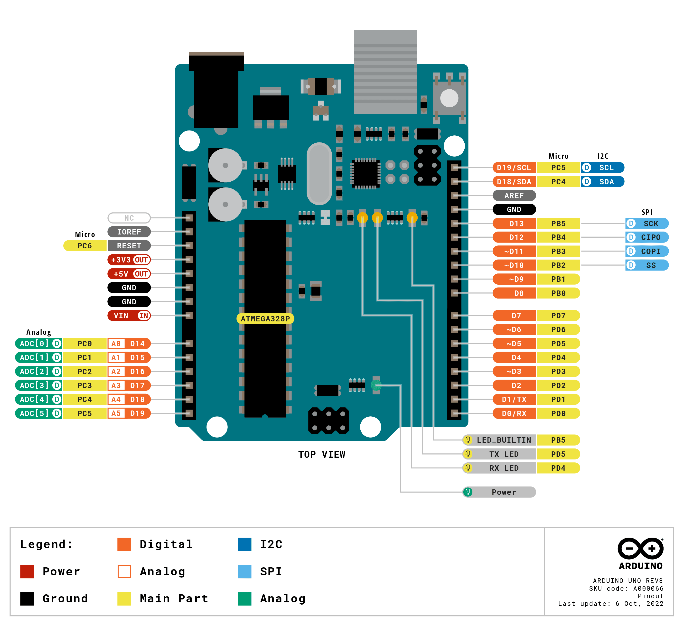
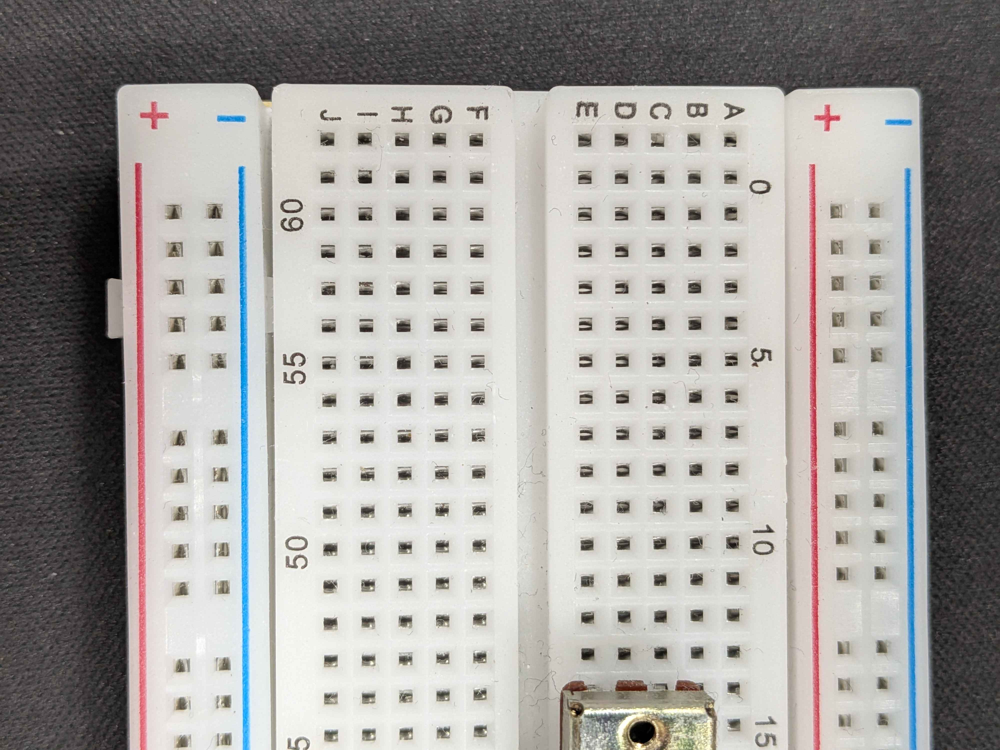
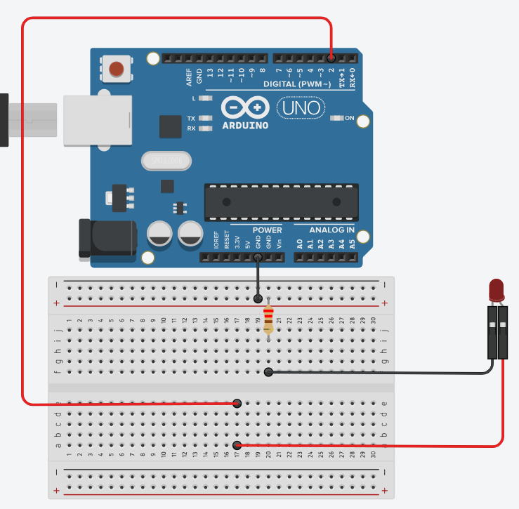
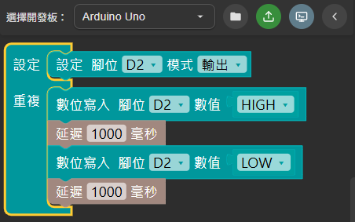
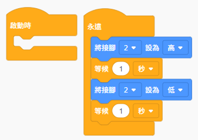
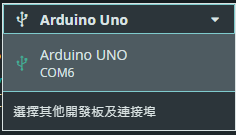

<h1 style="font-size: 2.5rem; font-weight: bold;">AI 概論與實作體驗</h1>
<h1 style="font-size: 5rem; margin-top: 0px; font-weight: bold;">#2 物聯網與微控制器</h1>

---
transition: slide-left
layout: top-title
color: dark
---
::title::

<h1 style="font-size: 3rem; padding-top: 10px; padding-bottom: 10px; font-weight: bold;  display: flex; justify-content: space-between;">
   <span>什麼是物聯網</span><span style="font-size: 2rem; color: gray;">生活中的物聯網</span>
</h1>

::content::

<div style="margin-bottom: 10px;">
    <div style="width: 100%; display: flex; align-items: flex-start; box-sizing: border-box;">
        <div style="width: 66%; padding-right: 20px; box-sizing: border-box;">
            <h2><span style="background:#FFE45E; color:black;">物聯網 (Internet of Things, IoT)</span>，是將裝置獲取的數據透過雲端或本地網路，操作、分析或是互動。</h2>
            <h2>現今是所謂「大人物」時代<br>
            <span style="background:#FFE45E; color:black;">大</span>數據(Big Data)<br>
            <span style="background:#FFE45E; color:black;">人</span>工智慧(Artificial Intelligence, AI)<br>
            <span style="background:#FFE45E; color:black;">物</span>聯網(Internet of Things, IoT)<br>
            已經成為生活的一部份</h2> 
        </div>
        <div style="width: 34%; display: flex; flex-direction: column; align-items: center; text-align: center; box-sizing: border-box;">
            <p><a href="https://commons.wikimedia.org/wiki/File:YouBike_2.0.jpg#/media/File:YouBike_2.0.jpg"></a><span style="font-size: 0.8rem;">由 <a href="//commons.wikimedia.org/w/index.php?title=User:Andy_Sou&amp;action=edit&amp;redlink=1" class="new" title="User:Andy Sou (page does not exist)">Andy Sou</a> - <span class="int-own-work" lang="zh-tw">自己的作品</span>, <a href="https://creativecommons.org/licenses/by-sa/4.0" title="Creative Commons Attribution-Share Alike 4.0">CC BY-SA 4.0</a>, <a href="https://commons.wikimedia.org/w/index.php?curid=85991765">連結</a></span><p>微笑單車 (YouBike/Ubike) 就是個經典的物聯網應用</p></p>
        </div>
    </div>
</div>

---
transition: slide-left
layout: top-title
color: dark
---
::title::

<h1 style="font-size: 3rem; padding-top: 10px; padding-bottom: 10px; font-weight: bold;  display: flex; justify-content: space-between;">
   <span>什麼是微控制器</span><span style="font-size: 2rem; color: gray;">裝置的基礎</span>
</h1>

::content::

<div style="margin-bottom: 10px;">
    <div style="width: 100%; display: flex; align-items: flex-start; box-sizing: border-box;">
        <div style="width: 66%; padding-right: 20px; box-sizing: border-box;">
            <h2><span style="background:#FFE45E; color:black;">微控制器 (Microcontroller Unit, MCU)</span>是將輸入輸出與運算所需要的單位整合的<span style="background:#FFE45E; color:black;">微型電腦。</span><br>
            Arduino UNO R3 就是將微控制器與電源、針腳等整合起來，經典的<span style="background:#FFE45E; color:black;">開發板 (Development Board)</span>。</h2>
            <h2 style="font-weight: bold;" v-click="1">
            什麼是微控制器?
            </h2>
            <h2 v-click="2">控制什麼? <text style="color: #00878f; background-color: #ffffff; font-weight: bold;" v-click="3">執行器 (Actuator)</text></h2>
            <h2 v-click="4">怎麼控制? <text style="color: #00878f; background-color: #ffffff; font-weight: bold;" v-click="5">程式邏輯</text></h2>
            <h2 v-click="6">怎麼互動? <text style="color: #00878f; background-color: #ffffff; font-weight: bold;" v-click="7">感測器 (Sensor)</text></h2>
        </div>
        <div style="width: 34%; display: flex; flex-direction: column; align-items: center; text-align: center; box-sizing: border-box;">
            <div style="width: 100%; border-radius: 12px; box-shadow: 0 10px 25px rgba(0,0,0,0.3); overflow: hidden; background: #1e293b;">    
            
            <div class="flex items-center justify-center gap-3 py-4">
                <span class="text-[10px] font-bold text-white bg-[#00878f] px-2 py-1 rounded uppercase tracking-wider">
                    Hardware
                </span>
                <span class="text-sm font-semibold text-gray-300 tracking-wide">
                    Arduino UNO R3
                </span>
            </div>
        </div>
        </div>
    </div>
</div>

---
transition: slide-left
layout: top-title
color: dark
---
::title::

<h1 style="font-size: 3rem; padding-top: 10px; padding-bottom: 10px; font-weight: bold;  display: flex; justify-content: space-between;">
   <span>微控制器的作用</span><span style="font-size: 2rem; color: gray;">回頭看微笑單車的例子</span>
</h1>

::content::
<div style="margin-bottom: 10px;">
    <div style="width: 100%; display: flex; align-items: flex-start; box-sizing: border-box;">
        <div style="width: 66%; padding-right: 20px; box-sizing: border-box;">
            <h2><span style="background:#FFE45E; color:black;">微控制器</span>接收並分析數據再透過通訊與雲端電腦或是同系統其他裝置進行互動，藉由設定的邏輯進行後續的互動。<br>
            以 Ubike 悠遊卡借車為例：<br>(Ⅰ) 按鈕喚醒微控制器後更新顯示器與 RFID 讀取器<br>(Ⅱ) 讀取器讀取悠遊卡 ID 並與站點資訊、車輛資訊與時間一同送到雲端系統<br>(Ⅲ) 雲端系統判斷沒問題後控制車鎖解鎖</h2> 
        </div>
        <div style="width: 34%; display: flex; flex-direction: column; align-items: center; text-align: center; box-sizing: border-box;">
            <p><a href="https://commons.wikimedia.org/wiki/File:Youbike_2.0%E8%BB%8A%E6%A9%9F.jpg#/media/File:Youbike_2.0%E8%BB%8A%E6%A9%9F.jpg"></a><span style="font-size: 0.8rem;">由 <a href="//commons.wikimedia.org/w/index.php?title=User:Rryyaann0523&amp;action=edit&amp;redlink=1" class="new" title="User:Rryyaann0523 (page does not exist)">Rryyaann0523</a> - <span class="int-own-work" lang="zh-tw">自己的作品</span>, <a href="https://creativecommons.org/licenses/by-sa/4.0" title="Creative Commons Attribution-Share Alike 4.0">CC BY-SA 4.0</a>, <a href="https://commons.wikimedia.org/w/index.php?curid=128650660">連結</a></span>
            <a href="https://commons.wikimedia.org/wiki/File:YouBike_2.0E_display.jpg#/media/File:YouBike_2.0E_display.jpg"></a><span style="font-size: 0.8rem;">由 嘉義市政府, Attribution, <a href="https://commons.wikimedia.org/w/index.php?curid=112965358">連結</a></span></p>
        </div>
    </div>
</div>

---
transition: slide-left
layout: top-title
color: dark
---
::title::

<h1 style="font-size: 3rem; padding-top: 10px; padding-bottom: 10px; font-weight: bold;  display: flex; justify-content: space-between;">
   <span>要使用開發板需要有哪些能力</span><span style="font-size: 2rem; color: gray;">這學期會學到的知識</span>
</h1>

::content::

<div style="margin-bottom: 10px;">
    <div style="width: 100%; display: flex; align-items: flex-start; box-sizing: border-box;">
        <div style="width: 66%; padding-right: 20px; box-sizing: border-box;">
            <ul style="font-size: 2rem;">
                <li>程式邏輯 (C/C++)</li>
                <li>基礎電路知識</li>
            </ul>
            <div v-click="1">
                <h2>BUT!<br>
                程式邏輯還是要有，不過程式能力可以藉由 Blockly (積木化程式) 克服。<br>
                過往需要反覆查找資料確認接線，現在也可以依靠 AI 跳過中間的過程。</h2>
            </div>
        </div>
        <div style="width: 34%; display: flex; flex-direction: column; align-items: center; text-align: center; box-sizing: border-box;">
            
        </div>
    </div>
</div>

---
transition: slide-left
layout: top-title
color: dark
---
::title::

<h1 style="font-size: 3rem; padding-top: 10px; padding-bottom: 10px; font-weight: bold;  display: flex; justify-content: space-between;">
   <span>課程中會使用的工具</span><span style="font-size: 2rem; color: gray;"></span>
</h1>

::content::

<div style="font-size: 1.8rem">
    整合開發環境
    <ul>
        <li><a href="https://support.arduino.cc/hc/en-us/articles/360019833020-Download-and-install-Arduino-IDE">Arduino IDE</a></li>
    </ul>
    接線模擬
    <ul>
        <li><a href="https://wokwi.com/projects/new/arduino-nano">Wokwi</a></li>
    </ul>
    blockly 程式
    <ul>
        <li><a href="https://www.tinkercad.com/dashboard">tinkercad</a></li>
        <li><a href="https://marketplace.visualstudio.com/items?itemName=Singular-Ray.singular-blockly">Singular Blockly (in Visual Studio Code)</a></li>
    </ul>
</div>

---
transition: slide-left
layout: top-title
color: dark
---

::title::

<h1 style="font-size: 3rem; padding-top: 10px; padding-bottom: 10px; font-weight: bold;  display: flex; justify-content: space-between;">
   <span>微控制器的作用 (Ⅰ)</span><span style="font-size: 2rem; color: gray;">另一個例子</span>
</h1>

::content::

<div style="margin-bottom: 10px;">
    <div style="width: 100%; display: flex; align-items: flex-start; box-sizing: border-box;">
        <div style="width: 66%; padding-right: 20px; box-sizing: border-box;">
            <h2>手電筒按一下開燈，再按一下關燈，但第二次開燈變成快速閃爍，再次關燈後開啟，又變回長亮</h2>
            <br>
            <br>
            <h2 style="font-size: 2.5rem; font-weight: bold;" v-click="1">如何做到的?</h2>
        </div>
        <div style="width: 34%; display: flex; flex-direction: column; align-items: center; text-align: center; box-sizing: border-box;">
            
        </div>
    </div>
</div>

---
transition: slide-left
layout: top-title
color: dark
---

::title::

<h1 style="font-size: 3rem; padding-top: 10px; padding-bottom: 10px; font-weight: bold;  display: flex; justify-content: space-between;">
   <span>微控制器的作用 (Ⅱ)</span><span style="font-size: 2rem; color: gray;">另一個例子</span>
</h1>

::content::

<div style="margin-bottom: 10px;">
    <div style="width: 100%; display: flex; align-items: flex-start; box-sizing: border-box;">
        <div style="width: 50%; padding-right: 20px; box-sizing: border-box;">
            <h2>手電筒的電路大致長這樣，要如何做到連續閃爍</h2>
            <svg xmlns="http://www.w3.org/2000/svg" viewBox="0 0 600 400" width="100%" height="100%">
               <g stroke-width="4" stroke-linecap="round" fill="none">
                  <path d="M 100 320 L 100 80 L 275 80" stroke="#ffffff" />
                  <path d="M 325 80 L 500 80 L 500 150" stroke="#ffffff" />
                  <path d="M 500 230 L 500 320 L 310 320" stroke="#ffffff" />
                  <path d="M 290 320 L 100 320" stroke="#ffffff" />
                  <circle cx="300" cy="80" r="20" stroke="#ffee03" stroke-width="5" />
                  <path d="M 500 230 L 525 165" stroke="#15ff00" stroke-width="7" />
                  <path d="M 310 285 L 310 355" stroke="#888888"  stroke-width="7"/>
                  <path d="M 290 295 L 290 345" stroke="#888888" stroke-width="7" />
               </g>
            </svg>
        </div>
        <div style="width: 50%; display: flex; flex-direction: column; align-items: center; text-align: center; box-sizing: border-box;">
            <h2 v-click="1">連續閃爍是微控制器中燒錄的程式控制的結果</h2>
            <svg xmlns="http://www.w3.org/2000/svg" viewBox="0 0 600 400" width="100%" height="100%" v-click="1">
               <g stroke-width="4" stroke-linecap="round" fill="none">
                  <path d="M 100 320 L 100 80 L 275 80" stroke="#ffffff" />
                  <path d="M 325 80 L 500 80 L 500 150" stroke="#ffffff" />
                  <path d="M 500 230 L 500 320 L 310 320" stroke="#ffffff" />
                  <path d="M 290 320 L 100 320" stroke="#ffffff" />
                  <circle cx="300" cy="80" r="20" stroke="#ffee03" stroke-width="5" />
                  <rect x="450" y="150" width="100" height="80" fill="none" stroke="#15ff00" stroke-width="4" />
                  <text x="500" y="190" fill="#ffffff" font-size="10" text-anchor="middle" dominant-baseline="central">
                  MCU
                  </text>
                  <path d="M 310 285 L 310 355" stroke="#888888"  stroke-width="7"/>
                  <path d="M 290 295 L 290 345" stroke="#888888" stroke-width="7" />
               </g>
            </svg>
        </div>
    </div>
</div>

---
transition: slide-left
layout: top-title
color: dark
---

::title::

<h1 style="font-size: 3rem; padding-top: 10px; padding-bottom: 10px; font-weight: bold;  display: flex; justify-content: space-between;">
   <span>認識開發板腳位</span><span style="font-size: 2rem; color: gray;">一些基礎知識</span>
</h1>

::content::

<div style="margin-bottom: 10px;">
    <div style="width: 100%; display: flex; align-items: flex-start; box-sizing: border-box;">
        <div style="width: 50%; padding-right: 20px; box-sizing: border-box;">
            <h2>
            腳位主要分成三類<text v-click="1">，每類中比較常用的是</text>
               <ul>
                  <li>電源 (Power) <br><text style="color: #00878f; font-size: 1.5rem; font-weight: bold; background-color: #ffffff;" v-click="1">3.3V、5V、GND</text></li>
                  <li>類比 (Analog) <br><text style="color: #00878f; font-size: 1.5rem; font-weight: bold; background-color: #ffffff;" v-click="1">A0~A5</text></li>
                  <li>數位 (Digital) <text style="color: #00878f; font-size: 2rem; font-weight: bold; background-color: #ffffff;" v-click="1">1 or 0</text><br><text style="color: #00878f; font-size: 1.5rem; font-weight: bold; background-color: #ffffff;" v-click="1">0~13</text></li>
               </ul>
            </h2>
        </div>
        <div style="width: 50%; display: flex; flex-direction: column; align-items: center; text-align: center; box-sizing: border-box;">
            
        </div>
    </div>
</div>


---
transition: slide-left
layout: top-title
color: dark
---

::title::

<h1 style="font-size: 3rem; padding-top: 10px; padding-bottom: 10px; font-weight: bold;  display: flex; justify-content: space-between;">
   <span>認識麵包板與單色LED</span><span style="font-size: 2rem; color: gray;">另一些基礎知識</span>
</h1>

::content::

<div style="margin-bottom: 10px;">
    <div style="width: 100%; display: flex; align-items: flex-start; box-sizing: border-box;">
        <div style="width: 50%; padding-right: 20px; box-sizing: border-box;">

<div style="font-size: 1.8rem;" class="highlight-math">

A$n$~E$n$ 有接通，F$n$~J$n$ 有接通，但 A$n$~E$n$ 不與 F$n$~J$n$ 接通 ( $n \in \mathbb{Z}^+$)

</div>
	</div>
        <div style="width: 50%; display: flex; flex-direction: column; align-items: center; text-align: center; box-sizing: border-box;">
		
		<h2>有長短腳<br>長腳接<text style="color: #00878f; font-size: 1.8rem; font-weight: bold; background-color: #ffffff;">高電位 (正極)</text><br>短腳接<text style="color: #00878f; font-size: 1.8rem; font-weight: bold; background-color: #ffffff;">低電位 (負極)</text>
		</h2>
        </div>
    </div>
</div>

---
transition: slide-left
layout: top-title
color: dark
---

::title::

<h1 style="font-size: 3rem; padding-top: 10px; padding-bottom: 10px; font-weight: bold;  display: flex; justify-content: space-between;">
   <span>LED 閃爍實作 (Ⅰ)</span><span style="font-size: 2rem; color: gray;">簡單的實作</span>
</h1>

::content::

<div style="margin-bottom: 10px;">
    <div style="width: 100%; display: flex; align-items: flex-start; box-sizing: border-box;">
        <div style="width: 50%; padding-right: 20px; box-sizing: border-box;">
            <h2>首先是接線，如幾頁前的電路圖<text  v-click="1">，由於 Arduino 是一塊整合 MCU 的開發版，可以看成這樣</text></h2>
			<svg xmlns="http://www.w3.org/2000/svg" viewBox="0 0 600 400" width="100%" height="100%">
				<g stroke-width="4" stroke-linecap="round" fill="none">
					<path d="M 100 320 L 100 80 L 275 80" stroke="#ffffff" />
					<path d="M 325 80 L 500 80 L 500 150" stroke="#ffffff" />
					<path d="M 500 230 L 500 320 L 310 320" stroke="#ffffff" />
					<path d="M 290 320 L 100 320" stroke="#ffffff" />
					<circle cx="300" cy="80" r="20" stroke="#ffee03" stroke-width="5" />
					<rect x="450" y="150" width="100" height="80" fill="none" stroke="#15ff00" stroke-width="4" />
					<text x="500" y="190" fill="#ffffff" font-size="10" text-anchor="middle" dominant-baseline="central">
					MCU
					</text>
					<path d="M 310 285 L 310 355" stroke="#888888"  stroke-width="7"/>
					<path d="M 290 295 L 290 345" stroke="#888888" stroke-width="7" />
					<rect v-click="1" x="50" y="140" width="500" height="120" fill="#00878f" stroke="#00878f" stroke-width="4" />
					<text v-click="1" x="300" y="200" fill="#ffffff" font-size="18" font-family="sans-serif" font-weight="bold" text-anchor="middle" dominant-baseline="central">
						Arduino UNO
					</text>
				</g>
			</svg>
        </div>
		<div style="width: 50%; display: flex; flex-direction: column; align-items: center; text-align: center; box-sizing: border-box;">
        	<h2 v-click="2">使用數位腳位操作輸出 (正極)<br>使用 GND 作為低電位 (負極) </h2>
			
        </div>
    </div>
</div>

---
transition: slide-left
layout: top-title
color: dark
---

::title::

<h1 style="font-size: 3rem; padding-top: 10px; padding-bottom: 10px; font-weight: bold;  display: flex; justify-content: space-between;">
   <span>LED 閃爍實作 (Ⅱ)</span><span style="font-size: 2rem; color: gray;">簡單的實作</span>
</h1>

::content::
<h2>開啟 Tinkercad 或 Sigular Blockly → 板子選 UNO (R3)</h2>
<div style="margin-bottom: 10px;">
    <div style="width: 100%; display: flex; align-items: flex-start; box-sizing: border-box;">
        <div style="width: 50%; padding-right: 20px; box-sizing: border-box;"> 
			<br>
			<h2>範例程式 (Singular Blockly)</h2>
			
		</div>
		<div style="width: 50%; display: flex; flex-direction: column; align-items: center; text-align: left; box-sizing: border-box;">
			<br>
			<h2>範例程式 (Tinkercad Blockly)</h2>
			
    	</div>
	</div>
</div>

---
transition: slide-left
layout: top-title
color: dark
---

::title::

<h1 style="font-size: 3rem; padding-top: 10px; padding-bottom: 10px; font-weight: bold;  display: flex; justify-content: space-between;">
   <span>LED 閃爍實作 (Ⅲ)</span><span style="font-size: 2rem; color: gray;">簡單的實作</span>
</h1>

::content::

<div style="margin-bottom: 10px;">
    <div style="width: 100%; display: flex; align-items: flex-start; box-sizing: border-box;">
        <div style="width: 50%; padding-right: 20px; box-sizing: border-box;">
            <h2>開啟 Arduino IDE → 檔案 → 新增 Sketch</h2>
<br>
<h2>範例程式</h2>

```cpp{lines:true}
void setup()
{
  pinMode(2, OUTPUT);
}

void loop()
{
  digitalWrite(2, HIGH);
  delay(1000);
  digitalWrite(2, LOW);
  delay(1000);
}
```

</div>
	<div style="width: 50%; display: flex; flex-direction: column; align-items: center; text-align: left; box-sizing: border-box;">
		<h2 style="margin-top: 50px; font-size: 1.2rem;">pinMode() 是宣告 (Void) 腳位 (Pin) 模式(Mode) 的函式 (Function)<br>
		必須填寫的參數 (Parameter) 有兩個，要設定的目標腳位，以及要設定的模式 INPUT or OUTPUT<br>
		digitalWrite() 是指定指定數位腳位輸出的函式<br>
		必須填寫的參數有兩個，要設定的腳位，以及輸出的值 HIGH (1) or LOW (0)<br>
		delay() 是進行下行程式前暫停指定時間的函式<br>
		必須填寫的參數為時間長度 (毫秒)
		</h2>
		<text><span style="background:#FFE45E; color:black;">Tips:</span> 這些資訊主要能從<a href="https://docs.arduino.cc/language-reference/">Arduino IDE 文件</a>找到</text>
		</div>
    </div>
</div>

---
transition: slide-left
layout: top-title
color: dark
---

::title::

<h1 style="font-size: 3rem; padding-top: 10px; padding-bottom: 10px; font-weight: bold;  display: flex; justify-content: space-between;">
   <span>LED 閃爍實作 (Ⅳ)</span><span style="font-size: 2rem; color: gray;">簡單的實作</span>
</h1>

::content::

<div style="margin-bottom: 10px;">
    <div style="width: 100%; display: flex; align-items: flex-start; box-sizing: border-box;">
		<div style="width: 50%; padding-right: 20px; box-sizing: border-box;">
			<h2>存檔後，先確定是否有接到開發板</h2>
			
			<h2>進行驗證</h2>
			
			<h2>接著上傳 (燒錄)</h2>
			
		</div>
		<div style="width: 50%; display: flex; flex-direction: column; align-items: center; text-align: left; box-sizing: border-box;">
			<video autoplay loop style="height: auto; width: auto;" src="./public/course1.mp4"></video>
		</div>
    </div>
</div>

---
transition: slide-left
layout: top-title
color: dark
---

::title::

<h1 style="font-size: 3rem; padding-top: 10px; padding-bottom: 10px; font-weight: bold;  display: flex; justify-content: space-between;">
   <span>認識按鈕開關</span><span style="font-size: 2rem; color: gray;"></span>
</h1>

::content::

